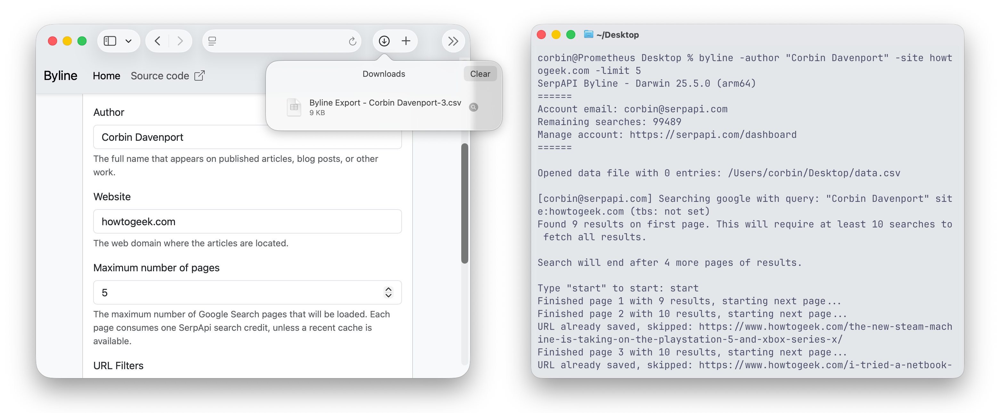

# Byline

Byline is a web application and command-line utility for finding your published articles, blog posts, and other published work across the web. It uses Google Search results through [SerpApi](https://serpapi.com/) to create a spreadsheet with links, titles, dates, and other metadata, ready for use in Google Docs, Microsoft Excel, and other software.

Byline's command-line version can use [Monolith](https://crates.io/crates/monolith) to create offline HTML backups of your published work. You can also use the spreadsheet with other backup solutions, like [ArchiveBox](https://archivebox.io/).



 

## Try the web app

**Hosted version coming soon!**

The web app does not currently support [importing existing CSV files](https://github.com/serpapi/byline/issues/4) or [backing up links with Monolith](https://github.com/serpapi/byline/issues/3). You have to install Byline and use the CLI app for those features.

## How to install Byline

Byline works on Windows, macOS, and Linux with the Node.js runtime.

### Windows

Press the `Win + X` keyboard shortcut, and select Windows PowerShell (Admin) or Terminal (Admin). Next, copy the below command, paste it into the window (Ctrl+V), and press the Enter/Return key:

```ps
winget install -e --id OpenJS.NodeJS.LTS
```

Open a new PowerShell Admin window or Terminal tab, then run this command:

```sh
npm install -g serpapi-byline
```

You can run `byline -help` to verify Byline is installed.

### Linux

The process for installing Node.js and NPM varies by distribution. Here's how to do it on Ubuntu-like distros:

```sh
sudo apt install nodejs npm
```

Then, install Byline from NPM:

```sh
npm install -g serpapi-byline
```

You can run `byline -help` to verify Byline is installed.

### macOS

Install the [Homebrew package manager](https://brew.sh), then open a new Terminal window/tab and run this command to install Node.js and NPM:

```
brew install node
```

Then, install Byline from NPM:

```sh
npm install -g serpapi-byline
```

You can run `byline -help` to verify Byline is installed.

## How to use the CLI app

You need to [register for a free SerpApi account](https://serpapi.com/users/sign_up) to use Byline.

First, open the Terminal or PowerShell again, and set the folder to store the spreadsheets and (optionally) article backups. You could use the Desktop folder with this command:

```shell
cd ~/Desktop
```

Next, log in with your SerpApi account, which will save your API key to a `byline-settings.txt` file in your current folder:

```bash
byline -login
```

Then run Byline with `-author` and `-site` options to create the link list, with `-limit` set to 20 to use a maximum of 20 search credits:

```bash
byline -author "Corbin Davenport" -site howtogeek.com -limit 20
```

This will create a file called `data.csv` in your folder containing all links. You can open and edit it in [Microsoft Excel](https://www.microsoft.com/en-us/microsoft-365/excel), [Apple Numbers](https://apps.apple.com/us/app/numbers-make-spreadsheets/id361304891), [LibreOffice](https://www.libreoffice.org/download/), [Google Docs](https://docs.google.com/), and other spreadsheet applications.

Run `byline -help` to see more options, like URL and publish date filters.

## How to back up links with the CLI app

Byline needs [Monolith](https://github.com/Y2Z/monolith) installed to create HTML backups of links from the CSV file.

**Install Monolith on Windows:** Press the `Win + X` keyboard shortcut, and select Windows PowerShell (Admin) or Terminal (Admin), and run this command:

```ps
winget install --id=Y2Z.Monolith -e
```

**Install Monolith on macOS:** With [Homebrew](https://brew.sh/) installed, open the Terminal application and run this command:

```sh
brew install monolith
```

**Install Monolith on Linux:** Check the [Monolith README](https://crates.io/crates/monolith) for installation options.

Next, switch to the folder containing your `data.csv` file and API key, like this:

```sh
cd ~/Desktop
```

Finally, start the backup:

```
byline -backup
```

## How to run the web app

You can start the web server with the `byline-web` command, and optionally specify a port:

```
byline-web -port 80
```

The web server can also run in [Docker](https://docs.docker.com/engine/install/) or another compatible container engine:

```bash
docker build -t "byline:main" .
docker run -p 80:8080 -d --restart on-failure "byline:main"
```

## Advanced usage

The Byline CLI application can read an API key from the `SERPAPI_KEY` environment variable. If the environment variable exists, the `byline-settings.txt` file will not be used.

If you want to run Byline from the checked out repository instead of the NPM package, use `node src/cli.js` instead of `byline` and `node src/web.js` instead of `byline-web`.

## Feature suggestions & bug reports

Found a bug that needs fixing? Have an idea for a feature? Check the [issues page](https://github.com/serpapi/byline/issues) first, and if it's not there, please create a new issue!